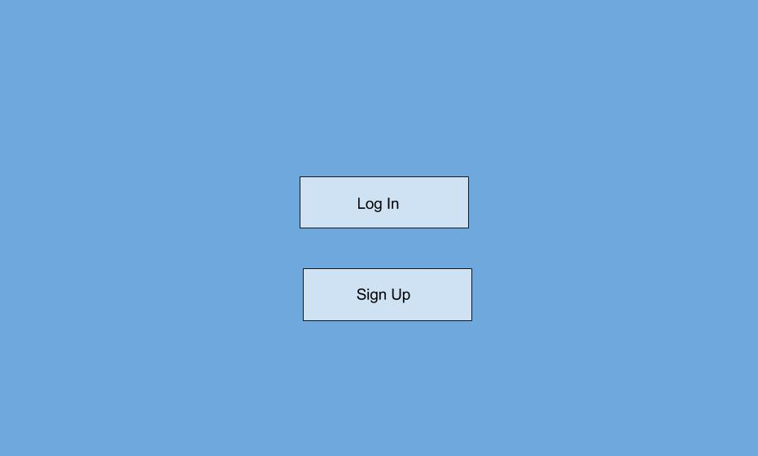
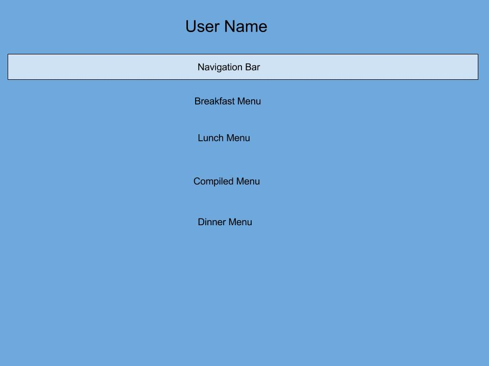
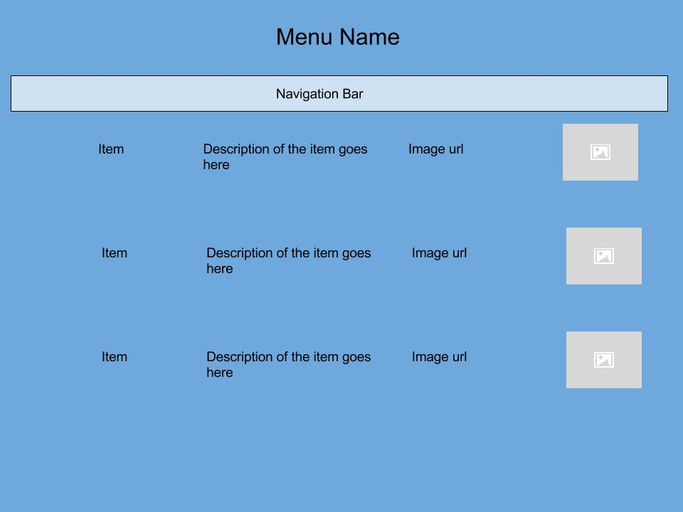
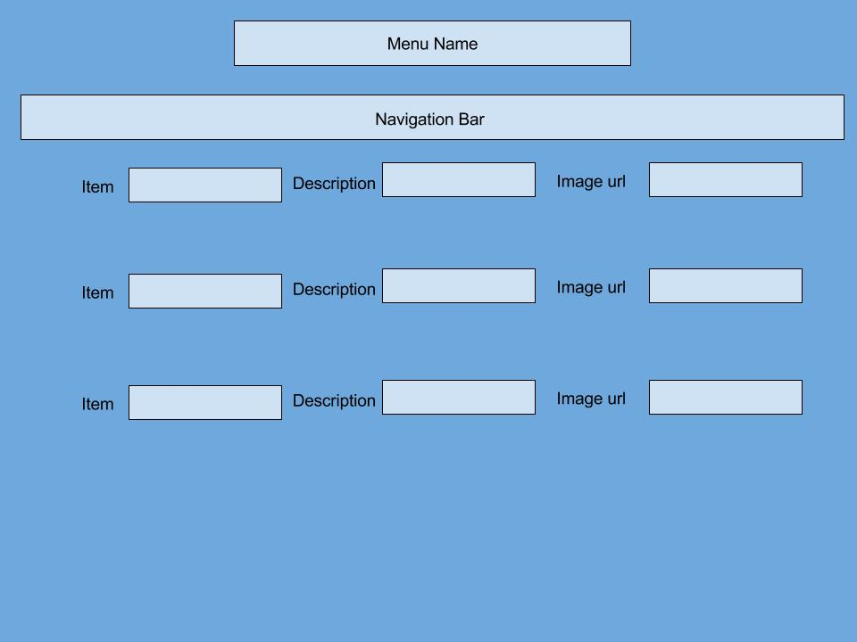
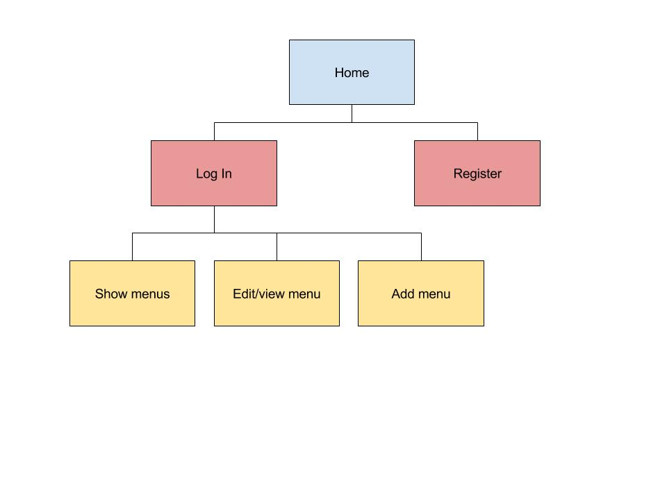

# BookExchange

## Overview

Exchanging books is difficult for students. Usually the most common medium is Facebook. BookExchange is a new medium for students to trade books where you can input your class name and have a platform specifically for trading books.

## Data Model


```javascript
// accounts
// * our site requires authentication that will be done using passportJS
var Account = new mongoose.Schema({
    username: String,
    password: String
});

//a user that can have more information aside from the passportjs information
var User = mongoose.Schema({
  login: String,
  username: String,
  user_img: String,
  image: mongoose.SchemaTypes.Url,
  phone_number: String,
  school: String
});

// a post used to sell books
var Post = mongoose.Schema({
  title: String,
  class_number: String,
  created_at: Date,
  description: String,
  username: String,
  login: String,
  user_img: String,
});
```

## Wireframes

/home - page for login or register


/login - page for login


/menus - page for viewing all menus


/menus/{menu-name} - page for viewing chosen menu


/add-menu - page for adding new menu


## Site map




## User stories

1. As a user, I can create a new post
2. As a user, I can edit or delete previous posts
3. As a user, I can view all posts that other users and myself have made

## Research Topics
* (6 points) Implementing User login using PassportJS
    * PassportJS is an open source framework for user logins
* (2 points) Using bootstrap
    * I will be using bootstrap for css styling
* ... for total of 8 points